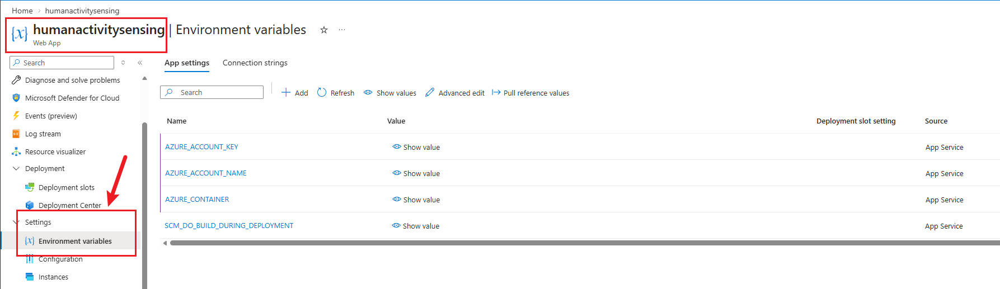

# Azure Blob Storage Setup

This guide explains how to connect this Django app running on Azure App Service to Azure Blob Storage so users can upload images through the app.

It is written for the current project setup:

- Django app deployed to Azure App Service
- image uploads handled through Django's default storage backend
- Azure Blob Storage used for uploaded media files
- static files handled separately from uploaded images

## How This App Uploads Images

This project already uses Django's `default` storage backend for image uploads. That means you do not need to rewrite the upload views to use Azure Blob Storage.

Once the Azure storage environment variables are configured, uploaded images are saved directly to your blob container through Django storage.

This app stores uploaded files under paths like:

```text
objects/activity-records/YYYY/MM/DD/<generated-file>.jpg
objects/site-observations/YYYY/MM/DD/<generated-file>.jpg
```

## Prerequisites

Before continuing, make sure you already have:

- an Azure Storage account
- a blob container created inside that storage account, for example `media`
- an Azure App Service deployment for this Django app
- either:
  - the storage account connection string, or
  - a managed identity enabled on the App Service with Azure RBAC access to Blob Storage

## Recommended Setup Order

1. Create or confirm a blob container exists.
2. Add the required App Service environment variables.
3. Restart the app if Azure does not restart it automatically.
4. Upload a test image from the app UI.
5. Confirm the image appears in the blob container.

## Step 1. Create a Blob Container

In the Azure portal:

1. Open your Storage account.
2. Go to `Data storage` -> `Containers`.
3. Create a container, for example `media`.

Use one container for uploaded media. This app already separates file categories internally using object paths, so you do not need separate containers for each upload type.

## Step 2. Configure Azure App Service Environment Variables

In the Azure portal:

1. Open your App Service.
2. Go to `Settings` -> `Environment variables`.
3. Add the settings below.
4. Save the changes.



App Service exposes these values to Django as environment variables and typically restarts the app after changes are applied.

Important:
Store `AZURE_CONNECTION_STRING` in `Environment variables` / `App settings`, not in the Azure `Connection strings` section. This project reads a normal environment variable named `AZURE_CONNECTION_STRING`.

## Step 3. Add the Base Storage Settings

Add these settings in Azure App Service:

```text
DJANGO_DEBUG=False
DJANGO_ALLOWED_HOSTS=<your-app>.azurewebsites.net,<your-custom-domain>
DJANGO_CSRF_TRUSTED_ORIGINS=https://<your-app>.azurewebsites.net,https://<your-custom-domain>
DJANGO_OBJECT_STORAGE_BACKEND=storages.backends.azure_storage.AzureStorage
DJANGO_OBJECT_STORAGE_PREFIX=objects
AZURE_CONTAINER=media
AZURE_ACCOUNT_NAME=<your-storage-account-name>
AZURE_URL_EXPIRATION_SECS=3600
```

Notes:

- `DJANGO_OBJECT_STORAGE_BACKEND=storages.backends.azure_storage.AzureStorage` switches uploads from local disk to Azure Blob Storage.
- `DJANGO_OBJECT_STORAGE_PREFIX=objects` keeps all uploaded files under the `objects/` prefix.
- `AZURE_CONTAINER` must match the blob container you created.
- `AZURE_URL_EXPIRATION_SECS=3600` is recommended when the container is private because generated image URLs will be signed and time-limited.

## Step 4. Choose an Authentication Method

This project supports multiple authentication methods for Azure Blob Storage. Use one of the two setups below.

### Option A. Use the Connection String

This is the fastest setup if you already have the storage account connection string.

Add:

```text
AZURE_CONNECTION_STRING=DefaultEndpointsProtocol=https;AccountName=<account>;AccountKey=<key>;EndpointSuffix=core.windows.net
```

You do not need to add `AZURE_ACCOUNT_KEY` when `AZURE_CONNECTION_STRING` is set.

This is the best option if you want the deployment working quickly with the credentials you already have.

### Option B. Use Managed Identity

This is the recommended production approach because it avoids storing storage secrets in App Service settings.

1. Open the App Service in Azure Portal.
2. Go to `Identity`.
3. Enable the system-assigned managed identity.
4. Open the Storage account.
5. Go to `Access control (IAM)`.
6. Assign the App Service identity the `Storage Blob Data Contributor` role.

Then add:

```text
AZURE_USE_MANAGED_IDENTITY=True
AZURE_ACCOUNT_NAME=<your-storage-account-name>
AZURE_URL_EXPIRATION_SECS=3600
```

Optional:

If you use a user-assigned managed identity, also set:

```text
AZURE_MANAGED_IDENTITY_CLIENT_ID=<client-id>
```

Important:
Azure role assignments may take several minutes to propagate. If uploads fail immediately after the role assignment, wait and retry.

## Optional Blob Settings

These are optional settings supported by the current project:

```text
AZURE_CUSTOM_DOMAIN=<cdn-or-custom-domain>
AZURE_CACHE_CONTROL=public,max-age=31536000,immutable
AZURE_OVERWRITE_FILES=False
AZURE_ENDPOINT_SUFFIX=core.windows.net
AZURE_UPLOAD_MAX_CONN=2
AZURE_CONNECTION_TIMEOUT_SECS=20
AZURE_BLOB_MAX_MEMORY_SIZE=2097152
```

Use cases:

- `AZURE_CUSTOM_DOMAIN` if you serve blobs through a CDN or custom domain
- `AZURE_CACHE_CONTROL` if you want long-lived cache headers on blob responses
- `AZURE_OVERWRITE_FILES=False` to avoid replacing files with the same name

## What Happens After Configuration

After these settings are applied:

- users upload images through the existing Django app
- the app sends uploaded files to Azure Blob Storage through Django storage
- the database stores the blob object path in `photo_object_name`
- API responses include a generated `photoUrl`

No view or model rewrite is required for basic Blob Storage integration.

## Verify the Setup

After saving the App Service settings:

1. Open the deployed site.
2. Upload a test image.
3. Confirm the request succeeds.
4. Open the storage account container in Azure Portal.
5. Check that a new blob exists under an `objects/...` path.
6. Confirm the saved record in the app returns a usable `photoUrl`.

## Common Problems

### Upload works locally but not on Azure

Check that these App Service settings are present:

- `DJANGO_OBJECT_STORAGE_BACKEND`
- `AZURE_CONTAINER`
- `AZURE_ACCOUNT_NAME`
- one authentication method:
  - `AZURE_CONNECTION_STRING`, or
  - `AZURE_USE_MANAGED_IDENTITY=True`

### The app starts failing on boot

This usually means one of the required Azure storage environment variables is missing. Recheck:

- `AZURE_CONTAINER`
- `AZURE_ACCOUNT_NAME` for managed identity or account-key-based auth
- `AZURE_CONNECTION_STRING` if using the connection string option

### Images upload but do not open

Check:

- the blob container access model
- whether `AZURE_URL_EXPIRATION_SECS` is set for private containers
- whether `AZURE_CUSTOM_DOMAIN` is correct if you configured one

### Managed identity is enabled but uploads still fail

Check:

- the App Service identity is enabled
- the identity has `Storage Blob Data Contributor`
- the role was assigned to the correct storage account or container
- enough time has passed for role propagation

## Example Minimal Production Configuration

If you want the shortest working setup using the connection string, this is enough:

```text
DJANGO_DEBUG=False
DJANGO_ALLOWED_HOSTS=<your-app>.azurewebsites.net
DJANGO_CSRF_TRUSTED_ORIGINS=https://<your-app>.azurewebsites.net
DJANGO_OBJECT_STORAGE_BACKEND=storages.backends.azure_storage.AzureStorage
DJANGO_OBJECT_STORAGE_PREFIX=objects
AZURE_CONTAINER=media
AZURE_ACCOUNT_NAME=<your-storage-account-name>
AZURE_CONNECTION_STRING=<your-connection-string>
AZURE_URL_EXPIRATION_SECS=3600
```

## Screenshot

Example Azure App Service environment variable screen:


## References

- [django-storages Azure Storage backend](https://django-storages.readthedocs.io/en/stable/backends/azure.html)
- [Azure App Service app settings and environment variables](https://learn.microsoft.com/en-us/azure/app-service/configure-common)
- [Authorize access to blobs using Microsoft Entra ID](https://learn.microsoft.com/en-us/azure/storage/blobs/authorize-access-azure-active-directory)
- [Assign Azure role for blob data access](https://learn.microsoft.com/en-us/azure/storage/blobs/assign-azure-role-data-access)
